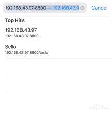

# Sello
A trello like application that uses Django as its backend

## Getting Started

Make sure that you have Python 3.7 to run the application. 
To start up the server use terminal to go to the unzip location.

### Prerequisites

Check the Python version (3.7.3) Django (2.2.1)

```
python --version
```
```
django-admin --version
```

Please go to [Django](https://docs.djangoproject.com/en/2.2/topics/install/) and [Python](https://www.python.org/downloads/) if you do not have any of the above
## Starting up

Start up the database
``` 
python manage.py makemigrations
```
Create the table needed
```
python manage.py migrate
```
Load in the dummy data provide (optional)
```
python manage.py loaddata fixtures/dummydata.json
```
Create a superuser for access to the database (optional)
```
python manage.py createsuperuser
```

### Start Server

cd to the location of the project folder

```
python manage.py runserver 0.0.0.0:8800
```

#### Mobile Access
Search your computer IP address (i.e 192.168.14.15)

Then you can access the website (within the same LAN)

```
http://192.168.14.15:8800
```

Demo



## Built With

* [Django](https://www.djangoproject.com/) - The web framework used
* [Bootstrap 4](https://getbootstrap.com/) - Frontend framework
* [jQuery 3.4.1](https://jquery.com/) - Used to generate RSS Feeds

## Authors

* **Sally Yue** - [OneBeatxdd](https://github.com/OneBeatxdd)

## Acknowledgments

* [Pexels](https://www.pexels.com/search/background/) - Free background photo
* Trello - inspiration